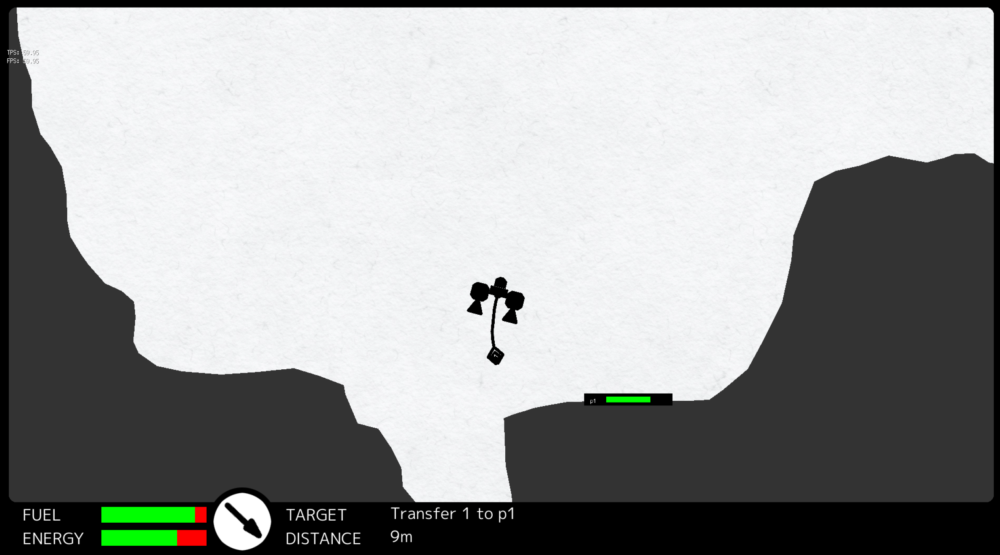

Space Crane game
================


[](https://codecov.io/gh/spiritofsim/go-space-crane)
[](https://goreportcard.com/report/github.com/spiritofsim/go-space-crane)

## Controls
 - **Arrows** - control ship engines
 - **Q**/**A** - wind/unwind crane chain
 - **Tab** - capture cargo


## Screenshots



## Features
### Levels
 - Levels are simple svg's you can draw in any SVG editor
   


### Ships

Ship consists of parts and described in simple yaml

**Parts**
 - Cabin [**cab**]
 - Engine [**eng**]
 - Crane [**crn**]
 - Tank [**tnk**]
 - Leg [**leg**]
 - LegFastening [**lft**]

**Example**
```yaml
  - -
    - cab dir=U
    -
  - - tnk
    - crn dir=D
    - tnk
  - - eng dir=D;pow=150;keys=30,31
    -
    - eng dir=D;pow=150;keys=29,31
```

### Tasks

There are 2 tasks types:
 - [**v**] - visit platform task
 - [**d**] - transfer carco to platform

**Example**
```yaml
tasks:
  - "d:1->p1"
  - "d:1->p2"
  - "v:p1"
```
